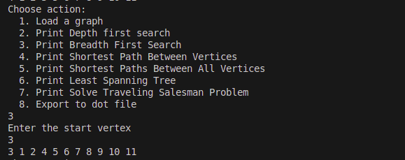
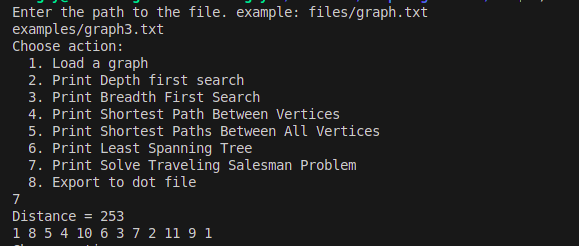

# GraphAlgorithms

## Information

В рамках данного задания все графы должны удовлетворять следующим требованиям:
- Веса ребер только натуральными числами.
- Могут быть петли.
- Веса могут отличаться на всех ребрах.
- Только ненулевой связный граф.

## Part 1. Обход графа в глубину и в ширину

Реализация библиотеки _s21_graph_:
* Библиотека разработана на языке С++ стандарта C++17.
* Решение оформлено как статическая библиотека (_s21_graph_).
* Библиотека представлена в виде класса `Graph`, который хранит в себе информацию о графе с помощью **матрицы смежности**.
* Сборка программы должна быть настроена с помощью Makefile со стандартным набором целей для GNU-программ: _all, clean, test, s21_graph_.
* Обеспечено полное покрытие unit-тестами методов класса `Graph`.
* Класс `Graph` содержит в себе следующие публичные методы:
    + `LoadGraphFromFile(string filename)` — загрузка графа из файла в формате матрицы смежности.
    + `ExportGraphToDot(string filename)` — выгрузка графа в файл в формате dot.

Пример матрицы смежности в исходном файле:
```
4
0 10 49 1
10 12 34 43
49 34 0 13
1 43 13 0
```

Пример dot файла:
```
digraph graphname {
    a -> b -> c;
    b -> d;
}
```

Реализуй библиотеку _s21_graph_algorithms_:
* Библиотека разработана на языке С++ стандарта C++17.
* Код библиотеки находиться в папке src в ветке develop.  
* Решение оформлено как статическая библиотека (_s21_graph_algorithms_).
* Библиотека представлена в виде класса `GraphAlgorithms`, который содержит в себе реализацию алгоритмов на графах..
* Обеспечено полное покрытие unit-тестами методов класса `GraphAlgorithms`.
* Класс `GraphAlgorithms` содержит в себе следующие публичные методы:    
    + `DepthFirstSearch(Graph &graph, int start_vertex)` — *нерекурентный* поиск в глубину в графе от заданной вершины. Функция возвращает массив, содержащий в себе обойдённые вершины в порядке их обхода. При реализации этой функции использовалась *самописная* структура данных **стек**, которая предварительно оформилена в виде отдельной статической библиотеки.
    + `BreadthFirstSearch(Graph &graph, int start_vertex)` — поиск в ширину в графе от заданной вершины. Функция возвращает массив, содержащий в себе обойдённые вершины в порядке их обхода. При реализации этой функции использовалась *самописная* структура данных **очередь**, которая предварительно оформлена в виде отдельной статической библиотеки.

## Part 2. Поиск кратчайших путей в графе

* Класс `GraphAlgorithms` содержит в себе следующие публичные методы:
    + `GetShortestPathBetweenVertices(Graph &graph, int vertex1, int vertex2)` — поиск кратчайшего пути между двумя вершинами в графе с использованием *алгоритма Дейкстры*. Функция принимает на вход номера двух вершин и возвращает численный результат, равный наименьшему расстоянию между ними.
    + `GetShortestPathsBetweenAllVertices(Graph &graph)` — поиск кратчайших путей между всеми парами вершин в графе с использованием *алгоритма Флойда-Уоршелла*. В качестве результата функция возвращает матрицу кратчайших путей между всеми вершинами графа.

## Part 3. Поиск минимального остовного дерева

* Класс `GraphAlgorithms` содержит в себе следующий публичный метод: 
    + `GetLeastSpanningTree(Graph &graph)` — поиск наименьшего остовного дерева в графе с помощью *алгоритма Прима*. В качестве результата функция возвращает матрицу смежности для минимального остовного дерева

## Part 4. Задача коммивояжера

* Класс `GraphAlgorithms` содержит в себе следующий публичный метод:
    + `SolveTravelingSalesmanProblem(Graph &graph)` — решение задачи коммивояжера с помощью *муравьиного алгоритма*. Алгоритм находит самый выгодный (короткий) маршрут, проходящий через все вершины графа хотя бы по одному разу с последующим возвратом в исходную вершину. В качестве результата функция возвращает структуру `TsmResult`, описанную ниже:
    ```cpp
    struct TsmResult {
        std::vector<int> vertices; // массив с искомым маршрутом (с порядком обхода вершин)
        double distance;           // длина этого маршрута
    }
    ``` 

## Part 5. Консольный интерфейс

* Основная программа, которая представляет из себя консольное приложение для проверки работоспособности реализованных библиотек s21_graph и s21_graph_algorithms
* Консольный интерфейс покрывает следующий функционал:
    1. Загрузка исходного графа из файла.
    2. Обход графа в ширину с выводом результата обхода в консоль.
    3. Обход графа в глубину с выводом результата обхода в консоль.
    4. Поиск кратчайшего пути между произвольными двумя вершинами с выводом результата в консоль.
    5. Поиск кратчайших путей между всеми парами вершин в графе с выводом результирующей матрицы в консоль.
    6. Поиск минимального остовного дерева в графе с выводом результирующей матрицы смежности в консоль.
    7. Решение задачи комивояжера с выводом результирующего маршрута и его длины в консоль.
    8. Экспорт матрицы смежности графа в dot файл.

## Сборка

Сборка программы настроена с помощью Makefile

* `make` - Сборка программы
* `make test` - Покрытие unit-тестами c помощью библиотеки GTest
* `make style` - Проверка кода на Google style
* `make clean` - Удаление ненужных файлов

## Примеры

### Breadth First Search Example



### Solve Traveling Salesman Problem Example


